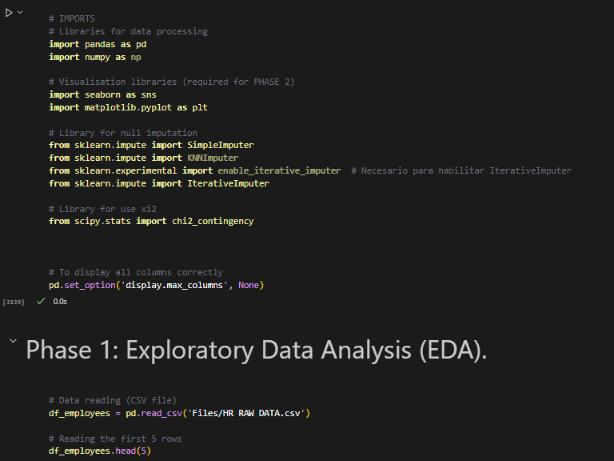

<h1 align="center" id="title"> Data Analyst Project: Employee Dataset Analysis</h1> 
<h2 align="center" id="title"> Work on a dataset of ABC Corporation employees. </h2> 

  

## INDEX

- [Introduction](#Introduction)
- [Files](#Files)
- [Requirements](#Requirements)
- [The process](#the-process)
  - [Built with](#built-with)
  - [First phase](#First-phase-deep-data-exploration)
    - [Importations](#Importing-libraries-and-loading-data)
    - [General](#General-exploration-and-cleaning)
  - [Second phase](#Second-phase-Data-transformation)
  - [Third phase](#Third-phase-Visualization)
  - [Fourth phase](#Fourth-phase-A\B-testing)
  - [Fifth phase](#Fifrth-phase-DataBase)
  - [Sixth phase](#Sixth-phase-ETL)
- [Author](#author)

## INTRODUCTION

This project conducts a comprehensive analysis of employee data from ABC Corporation, aiming to identify key factors influencing job satisfaction and employee retention. The analysis includes exploratory data analysis (EDA), data transformation, A/B testing, visualizations, and the development of a MySQL database and ETL process.
  
## FILES

Files required for project review:

*    HR RAW EMPLOYEES.csv: contains information about ABC Corporation employees.
*    HR RAW DATA CLEAN.csv: CSV file created by us after a thorough cleaning of the data from the initial CSV.
*    BBDD_abc_corp_employees.sql: DB created by us from the CSV we generated after data cleansing.

## REQUIREMENTS

*Make sure you have the following libraries installed in your Python environment:*

1. pandas
2. numpy
3. matplotlib
4. seaborn
5. scikit-learn
6. mysql connector
7. scipy stats, chi2_contingency

If you do not have these libraries, you can install them using *pip install* 

## THE PROCESS 
### Built with

*Technologies used in the project:*

*   Operating system: Windows 10 Home
*   Development Environment: Jupyter Notebook, Visual Studio Code
*   Programming Language: Python
*   Libraries specified above
*   Version Control: Git, GitHub
*   Dependency Management: Pip
*   MySQL Workbench

### First phase: deep data exploration

#### Importing libraries and loading data:

*Importing and use of pandas to load CSV files into DataFrames.*

  

#### General exploration 

*   General deep review and analysis of data using Pandas functions to obtain information about the structure of the data and basic statistics.
*   Initial exploration of the data to identify potential problems (null values, duplicate values, outliers, missing data, etc.).
*   DataFrame joining

### Second phase: data transformation

*   Verification of data consistency and correctness.
*   Removing unnecesary columns
*   Homogenization of titles and values.
*   Treatment of negative numbers, outliers, null data and duplicated values.

### Third phase: visualization

Study of six real-world questions about the data and their representation through graphs.

### Fourth phase: DataBase

Statistical hypothesis testing to determine whether job satisfaction levels have a significant effect on employee turnover. This involved dividing employees into two groups based on satisfaction (e.g., high vs. low), comparing their turnover rates using A/B testing methods, and analyzing the effect size to assess the magnitude of the relationship.

### Fifth phase: DataBase

Creation of a DB (with clean DF) in MySQL Workbench, editing tables and their corresponding relations/restrictions. Lastly, creation of the DB diagram.

### Sixth phase: ETL

Data extraction, transformation and loading (ETL): -automation of the data insertion into the DB and the information transformation process to ensure that information is updated and inserted in a consistent manner.

## Author

Made with 💜 by [Belén V N (https://github.com/BelenVN), Gloria L C (https://github.com/GloriaLopezChinarro), Viviana V R (https://github.com/Viviana1988) y Cristina R H (https://github.com/cristinarull14)]

#### 🖖🏽 LIVE LONG AND PROSPER
 
